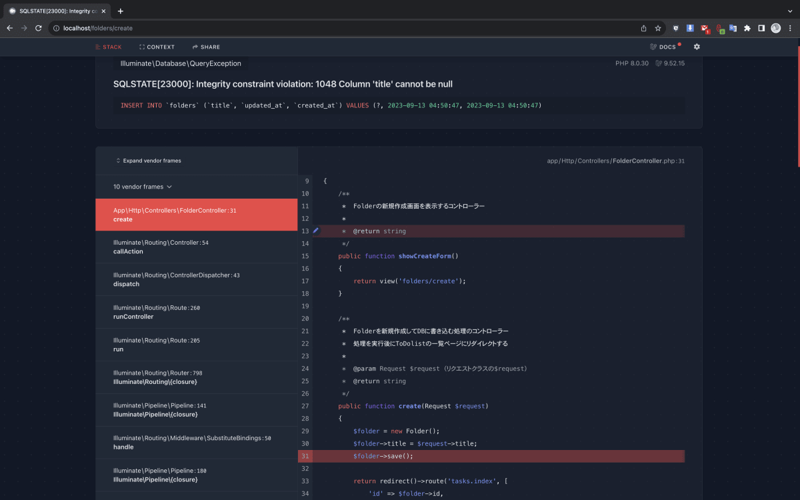

## 機能一覧

### 1. タスク管理機能

- **タスクの作成**

  - タスクは以下の属性を持つ：
    - タイトル
    - 期限日
    - 状態（「未着手」「着手中」「完了」の 3 種類）

- **タスクの一覧表示**

- **タスクの編集**

  - 編集可能な項目：
    - タイトル
    - 期限日
    - 状態

- **タスクの削除**

---

### 2. フォルダ管理機能

- **フォルダの作成**

- **フォルダの一覧表示**

- **フォルダの編集**

  - 編集可能な項目：
    - タイトル

- **フォルダの削除**

---

### 3. ユーザー管理機能

- **アカウント作成**

- **ログイン・ログアウト**

- **ログイン後の操作**

  - 自分のフォルダおよびタスクのみを閲覧・編集・削除できる。

- **パスワード再登録**
  - ユーザーがパスワードを忘れた場合に再登録できる。

---

### 4. セキュリティ機能

- **ユーザーデータの保護**

  - 各ユーザーのデータは他のユーザーから見えないようにする。

- **認証機能**

  - ログイン必須の機能については認証を求める。

- **本人確認**
  - パスワード再登録時には本人確認を行う。

## URL 設計

| URL                                             | HTTP メソッド | 説明                         |
| ----------------------------------------------- | ------------- | ---------------------------- |
| /folders/{フォルダ ID}/tasks                    | GET           | タスク一覧ページを表示する   |
| /folders/create                                 | GET           | フォルダ作成ページを表示する |
| /folders/create                                 | POST          | フォルダ作成処理を実行する   |
| /folders/{id}/edit                              | GET           | フォルダ編集ページを表示する |
| /folders/{id}/edit                              | POST          | フォルダ編集処理を実行する   |
| /folders/{id}/delete                            | GET           | フォルダ削除ページを表示する |
| /folders/{id}/delete                            | POST          | フォルダ削除処理を実行する   |
| /folders/{フォルダ ID}/tasks/create             | GET           | タスク作成ページを表示する   |
| /folders/{フォルダ ID}/tasks/create             | POST          | タスク作成処理を実行する     |
| /folders/{フォルダ ID}/tasks/{タスク ID}/edit   | GET           | タスク編集ページを表示する   |
| /folders/{フォルダ ID}/tasks/{タスク ID}/edit   | POST          | タスク編集処理を実行する     |
| /folders/{フォルダ ID}/tasks/{タスク ID}/delete | GET           | タスク削除ページを表示する   |
| /folders/{フォルダ ID}/tasks/{タスク ID}/delete | POST          | タスク削除処理を実行する     |

---

## 環境構築手順

### ディレクトリの作成

1. 各端末の作業用のディレクトリに移動
2. laravel-todo というディレクトを作成

```bash
mkdir laravel-todo
```

### Docker

1. larave-todo 直下に docker-compose.yml を作成

```bash
cd laravel-todo && touch docker-compose.yml
```

docker-compose.yml

```docker-compose.yml
version: "3"
services:
  db:
    platform: linux/amd64
    image: mysql:5.7.36
    container_name: "mysql_test"
    environment:
      MYSQL_ROOT_PASSWORD: root
      MYSQL_DATABASE: todolist
      MYSQL_USER: admin
      MYSQL_PASSWORD: secret
      TZ: "Asia/Tokyo"
    # ポートフォワードの指定（ホスト側ポート：コンテナ側ポート）
    ports:
      - 3306:3306
    # コマンドの指定
    command: mysqld --character-set-server=utf8mb4 --collation-server=utf8mb4_unicode_ci
    # 名前付きボリュームを設定する（名前付きボリューム:コンテナ側ボリュームの場所）
    volumes:
      - db_data_test:/var/lib/mysql
      - db_my.cnf_test:/etc/mysql/conf.d/my.cnf
      - db_sql_test:/docker-entrypoint-initdb.d

  php:
    build: ./docker/php
    container_name: "php-fpm"
    # ボリュームを設定する（ホスト側ディレクトリ:コンテナ側ボリュームの場所）
    volumes:
      - ./src:/var/www

  nginx:
    image: nginx:latest
    container_name: "nginx_test"
    # ポートフォワードの指定（ホスト側ポート：コンテナ側ポート）
    ports:
      - 80:80
    # ボリュームを設定する（ホスト側ディレクトリ:コンテナ側ボリュームの場所）
    volumes:
      - ./src:/var/www
      - ./docker/nginx/default.conf:/etc/nginx/conf.d/default.conf
    # サービスの依存関係を指定（nginxをphpに依存させる）
    depends_on:
      - php

  phpmyadmin:
    image: phpmyadmin/phpmyadmin:latest
    container_name: "phpmyadmin_test"
    environment:
      - PMA_ARBITRARY=1 # サーバ設定：サーバーをローカル以外も指定
      - PMA_HOST=db # ホスト設定：dbを指定
      - PMA_USER=root # 初期ユーザー設定：adminを指定
      - PMA_PASSWORD=root # 初期PW設定：secretを指定
    # db（サービス名）とのリンクを設定する
    links:
      - db
    # ポートフォワードの指定（ホスト側ポート：コンテナ側ポート）
    ports:
      - 8080:80
    # ボリュームを設定する（ホスト側ディレクトリ:コンテナ側ボリュームの場所）
    volumes:
      - ./phpmyadmin/sessions:/sessions

  node:
    image: node:14.18-alpine
    container_name: "node14.18-alpine"
    # コンテナ内の標準出力とホストの出力を設定：trueを指定
    tty: true
    # ボリュームを設定する（ホスト側ディレクトリ:コンテナ側ボリュームの場所）
    volumes:
      - ./src:/var/www
    # コンテナ起動後のカレントディレクトリを設定
    working_dir: /var/www

  mail:
    image: mailhog/mailhog
    container_name: "mailhog"
    # ポートフォワードの指定（ホスト側ポート：コンテナ側ポート）
    ports:
      - 8025:8025

# サービスレベルで名前付きボリュームを命名する
volumes:
  db_data_test:
  db_my.cnf_test:
  db_sql_test:

```

2. docker と src ディレクトリを作成

```bash
mkdir docker && mkdir src
```

3. docker ディレクト内に php と nginx ディレクトリを作成

```bash
cd docker && mkdir php && mkdir nginx
```

4. php ディレクト内に Dockerfile php.ini を作成

```bash
cd php && touch Dockerfile && touch php.ini
```

```Dockerfile
# Dockerimage の指定
FROM php:8.1-fpm
COPY php.ini /usr/local/etc/php/

# Package & Library install
RUN apt-get update \
    && apt-get install -y zlib1g-dev mariadb-client vim libzip-dev \
    && docker-php-ext-install zip pdo_mysql

# Composer install
RUN php -r "copy('https://getcomposer.org/installer', 'composer-setup.php');"
RUN php composer-setup.php
RUN php -r "unlink('composer-setup.php');"
RUN mv composer.phar /usr/local/bin/composer

ENV COMPOSER_ALLOW_SUPERUSER 1
ENV COMPOSER_HOME /composer
ENV PATH $PATH:/composer/vendor/bin

# WorkDir Path setting
WORKDIR /var/www

# Laravel Package install
RUN composer global require "laravel/installer"
```

```php.ini
; 日付設定
[Date]
date.timezone = "Asia/Tokyo"
; 文字＆言語設定
[mbstring]
mbstring.internal_encoding = "UTF-8"
mbstring.language = "Japanese"
```

5. nginx ディレクトリ内に default.conf を作成

```bash
cd ../nginx && touch default.conf
```

```default.conf
server {
    listen 80;
    index index.php index.html;

    root /var/www/public;

    location / {
        try_files $uri $uri/ /index.php?$query_string;
    }

    location ~ \.php$ {
        fastcgi_split_path_info ^(.+\.php)(/.+)$;
        fastcgi_pass php:9000;
        fastcgi_index index.php;
        include fastcgi_params;
            fastcgi_param SCRIPT_FILENAME $document_root$fastcgi_script_name;
            fastcgi_param PATH_INFO $fastcgi_path_info;
    }
}
```

6. Docker を起動

```bash
cd ../../ && docker-compose up -d
```

### Laravel プロジェクトの作成

1. php コンテナに移動

```bash
docker-compose exec php bash
```

2. Laravel をインストール

```bash
composer create-project "laravel/laravel=10.*" .
```

3. .env の内容を変更

```.env
DB_CONNECTION=mysql
DB_HOST=db
DB_PORT=3306
DB_DATABASE=todolist
DB_USERNAME=root
DB_PASSWORD=root
```

4. マイグレーションの実行

```bash
php artisan migrate
```

---

## TailwindCSS の導入

1. パッケージのインストール

```bash
npm install -D tailwindcss postcss autoprefixer
npx tailwindcss init -p
```

2. Tailwind CSS の設定

```tailwind.config.js
/** @type {import('tailwindcss').Config} */
export default {
  content: [
    './resources/**/*.blade.php',
    './resources/**/*.js',
    './resources/**/*.vue',
  ],
  theme: {
    extend: {},
  },
  plugins: [],
}
```

3. CSS ファイルに Tailwind のディレクティブを追加

```resources/css/app.css
@tailwind base;
@tailwind components;
@tailwind utilities;
```

4. Vite 経由で CSS を読み込み

```php
@vite(['resources/css/app.css', 'resources/js/app.js'])
```

5. ビルド

```bash
npm run dev
```

## 実装手順

### フォルダー機能の作成

1. Controller の作成

```bash
php artisan make:controller TaskController
```

2. ルーティングの追加

```web.php
Route::get('/folders/{id}/tasks', [TaskController::class, 'index'])->name('tasks.index');
```

3. マイグレーションの作成と実行

- マイグレーションの作成

```bash
php artisan make:migration create_folders_table --create=folders
```

- マイグレーションファイルの編集

```Y_m_d_His_create_folders_table.php
    public function up(): void
    {
        Schema::create('folders', function (Blueprint $table) {
            $table->id();
            $table->string('title', 20);
            $table->timestamps();
        });
    }
```

- マイグレーションの実行

```bash
php artisan migrate
```

4. モデルの作成

```bash
php artisan make:model Folder
```

5. テストデータの作成

- Factory の作成

```bash
php artisan make:factory FolderFactory
```

```FolderFactory.php
  public function definition(): array
  {
      return [
          'title' => $this->faker->word,
          'created_at' => Carbon::now(),
          'updated_at' => Carbon::now(),
      ];
  }
```

- Seeder の作成

```bash
php artisan make:seeder FoldersTableSeeder
```

- Seeder の編集

```FoldersTableSeeder
Folder::factory()->count(10)->create();
```

6. フォルダー機能の作成

- Controller の編集

```TaskController.php
    public function index(int $id)
    {
        $folders = Folder::all();

        return view('tasks/index', [
            'folders' => $folders,
            "folder_id" => $id
        ]);
    }
```

- View ファイルの作成

```bash
php artisan make:view tasks/index
```

- View ファイルの編集

```src/resources/views/tasks/index.blade.php
<x-layout.home>
    <div class="min-h-screen bg-gray-100">
        <div class="container mx-auto py-8">
            <div class="flex gap-8">
                <div class="w-1/3">
                    <nav class="border rounded-lg shadow bg-white">
                        <div class="bg-gray-200 px-4 py-2 font-semibold rounded-t-lg">フォルダ</div>
                        <div class="p-4">
                            <a href="#"
                                class="block w-full text-center py-2 px-4 border rounded bg-gray-100 hover:bg-gray-200">
                                フォルダを追加する
                            </a>
                        </div>
                        <div class="list-group">
                            <table class="w-full border-collapse table-auto">
                                @foreach($folders as $folder)
                                <tr class="border-b">
                                    <td class="py-2 px-4 text-left">
                                        <a href="{{ route('tasks.index', ['id' => $folder->id]) }}"
                                            class="list-group-item {{ $folder_id === $folder->id ? 'active' : '' }}">
                                            {{ $folder->title }}
                                        </a>
                                    </td>
                                    <td class="py-2 px-4 whitespace-nowrap text-center">
                                        <a href="#" class="text-blue-500 hover:underline">編集</a>
                                    </td>
                                    <td class="py-2 px-4 whitespace-nowrap text-center">
                                        <a href="#" class="text-red-500 hover:underline">削除</a>
                                    </td>
                                </tr>
                                @endforeach
                            </table>
                        </div>
                    </nav>
                </div>

                <div class="w-2/3">
                </div>
            </div>
        </div>
    </div>
</x-layout.home>

```

### タスク一覧機能の実装

1. マイグレーションの作成・実行

- マイグレーションの作成

```bash
php artisan make:migration create_tasks_table --create=tasks
```

```Y_m_d_His_create_tasks_table.php
    public function up(): void
    {
        Schema::create('tasks', function (Blueprint $table) {
            $table->id();
            $table->foreignId('folder_id')
                ->constrained()
                ->onDelete('cascade');
            $table->string('title', 100);
            $table->date('due_date');
            $table->integer('status')->default(1);
            $table->timestamps();
        });
    }
```

- マイグレーションの実施

```bash
php artisan migrate
```

2. モデルの作成

```bash
php artisan make:model Task
```

3. テストデータの作成

- Factory の作成

```bash
php artisan make:factory TaskFactory
```

```TaskFactory.php
    public function definition(): array
    {
        return [
            'folder_id' => 1,
            'title' => $this->faker->word,
            'status' => $this->faker->randomElement([1, 2, 3]),
            'due_date' => Carbon::now()->addDay(rand(1, 3)),
            'created_at' => Carbon::now(),
            'updated_at' => Carbon::now(),
        ];
    }

    public function withTitle(string $title)
    {
        return $this->state([
            'title' => $title,
        ]);
    }
```

- Seeder の作成

```bash
php artisan make:seeder TasksTableSeeder
```

```TasksTableSeeder.php
    public function run(): void
    {
        for ($i = 1; $i <= 3; $i++) {
            Task::factory()->withTitle('サンプルタスク'.$i)->create();
        }
    }
```

```DatabaseSeeder.php
    public function run(): void
    {
        $this->call(FoldersTableSeeder::class);
        $this->call(TasksTableSeeder::class);
    }
```

- Seeder の実行

```bash
php artisan db:seed
```

4. Controller の修正

```TaskController.php
    public function index(int $id)
    {
        $folders = Folder::all();

        $folder = Folder::find($id);

        $tasks = $folder->tasks()->get();

        return view('tasks/index', [
            'folders' => $folders,
            'folder_id' => $folder->id,
            'tasks' => $tasks
        ]);
    }
```

**Folder::find($id)**
Find メソッドは主キーを条件に検索を行う

**Tasks::where('folder_id', $folder->id)->get()**
クエリビルダは SQL を書かなくても Laravel が SQL を生成してくれる

5. View の修正

```src/resources/views/tasks/index.blade.php
<div class="w-2/3 mx-auto">
  <div class="bg-white shadow-md rounded-lg">
      <div class="bg-gray-200 font-bold px-4 py-2 rounded-t-lg">
          タスク
      </div>

      <div class="p-4">
          <div class="text-right">
              <a href="#"
                  class="block w-full bg-blue-500 hover:bg-blue-600 text-white text-center py-2 px-4 rounded">
                  タスクを追加する
              </a>
          </div>
      </div>

      <table class="min-w-full border-collapse border border-gray-300">
          <thead>
              <tr class="bg-gray-100 border-b border-gray-300">
                  <th class="text-left px-4 py-2">タイトル</th>
                  <th class="text-left px-4 py-2">状態</th>
                  <th class="text-left px-4 py-2">期限</th>
                  <th class="text-center px-4 py-2">編集</th>
                  <th class="text-center px-4 py-2">削除</th>
              </tr>
          </thead>
          <tbody>
              @foreach($tasks as $task)
              <tr class="border-b border-gray-300 hover:bg-gray-50">
                  <td class="px-4 py-2">{{ $task->title }}</td>
                  <td class="px-4 py-2">
                      <span
                          class="inline-block px-2 py-1 text-sm font-medium bg-gray-200 rounded {{ $task->status_class }}">
                          {{ $task->status_label }}
                      </span>
                  </td>
                  <td class="px-4 py-2">{{ $task->formatted_due_date }}</td>
                  <td class="text-center px-4 py-2">
                      <a href="#" class="text-blue-500 hover:text-blue-700">
                          編集
                      </a>
                  </td>
                  <td class="text-center px-4 py-2">
                      <a href="#" class="text-red-500 hover:text-red-700">
                          削除
                      </a>
                  </td>
              </tr>
              @endforeach
          </tbody>
      </table>
  </div>
</div>
```

6. モデルにアクセサを追加

```Task.php
public const STATUS = [
        1 => ['label' => '未着手', 'class' => 'bg-red-500 text-white rounded px-2 py-1'],
        2 => ['label' => '着手中', 'class' => 'bg-blue-500 text-white rounded px-2 py-1'],
        3 => ['label' => '完了', 'class' => 'bg-gray-500 text-white rounded px-2 py-1'],
    ];

    /**
     * ステータス（状態）ラベルのアクセサメソッド
     *
     * @return string
     */
    public function getStatusLabelAttribute()
    {
        $status = $this->attributes['status'];

        if (!isset(self::STATUS[$status])) {
            return '';
        }

        return self::STATUS[$status]['label'];
    }

    /**
     * 状態を表すHTMLクラスのアクセサメソッド
     *
     * @return string
     */
    public function getStatusClassAttribute()
    {
        $status = $this->attributes['status'];

        if (!isset(self::STATUS[$status])) {
            return '';
        }

        return self::STATUS[$status]['class'];
    }

    /**
     * 整形した期限日のアクセサメソッド
     *
     * @return string
     */
    public function getFormattedDueDateAttribute()
    {
        return Carbon::createFromFormat('Y-m-d', $this->attributes['due_date'])
            ->format('Y/m/d');
    }
```

7. モデルのリレーション

```Folder.php
    /*
    * フォルダクラスとタスククラスを関連付けするメソッド
    *
    * @return \Illuminate\Database\Eloquent\Relations\HasMany
    */
    public function tasks()
    {
        return $this->hasMany('App\Models\Task');
    }
```

### フォルダ作成機能

1. ルーティング
   | URL | HTTP メソッド | 説明 |
   | ----------------------------------------------- | ------------- | ---------------------------- |
   | /folders/create | GET | フォルダ作成ページを表示する |
   | /folders/create | POST | フォルダ作成処理を実行する |

```web.php
use App\Http\Controllers\FolderController;

Route::get('/folders/create', [FolderController::class,"showCreateForm"])->name('folders.create');
Route::post('/folders/create', [FolderController::class,"create"]);

```

2. フォームの表示

- Controller の作成

```bash
php artisan make:controller FolderController
```

- Controller の編集

```FolderController.php
    /**
     *  【フォルダ作成ページの表示機能】
     *
     *  GET /folders/create
     *  @return \Illuminate\View\View
     */
    public function showCreateForm()
    {
        return view('folders/create');
    }

    /**
     *  【フォルダの作成機能】
     *
     *  POST /folders/create
     *  @param Request $request （リクエストクラスの$request）
     *  @return \Illuminate\Http\RedirectResponse
     */
    public function create(Request $request)
    {
        $folder = new Folder();
        $folder->title = $request->title;
        $folder->save();

        return redirect()->route('tasks.index', [
            'id' => $folder->id,
        ]);
    }
```

**Request クラス**
Request クラスのインスタンスにはユーザーの入力フォームの入力値などが含まれる

**データベースへの書き込み**
データベースへの書き込みは以下の手順で実装します。

1. モデルクラスのインスタンスを作成する。
2. インスタンスのプロパティに値を代入する。
3. save メソッドを呼び出す。

- View の作成

```bash
php artisan make:view folders/create
```

- View の編集

```src/resources/views/folders/create.blade.php
<div class="flex justify-center">
    <div class="w-full max-w-md">
        <div class="bg-white shadow-md rounded-lg">
            <div class="bg-gray-800 text-white font-bold px-4 py-2 rounded-t-lg">
                フォルダを追加する
            </div>
            <div class="p-6">
                <form action="{{ route('folders.create') }}" method="post">
                    @csrf
                    <div class="mb-4">
                        <label for="title" class="block text-sm font-medium text-gray-700">
                            フォルダ名
                        </label>
                        <input
                            type="text"
                            name="title"
                            id="title"
                            class="mt-1 block w-full border-gray-300 rounded-md shadow-sm focus:ring-blue-500 focus:border-blue-500"
                        />
                    </div>
                    <div class="text-right">
                        <button
                            type="submit"
                            class="bg-blue-500 hover:bg-blue-600 text-white font-bold py-2 px-4 rounded"
                        >
                            送信
                        </button>
                    </div>
                </form>
            </div>
        </div>
    </div>
</div>
```

```src/resources/views/tasks/index.blade.php
<a href="{{ route('folders.create') }}"
    class="block w-full text-center py-2 px-4 border rounded bg-gray-100 hover:bg-gray-200">
    フォルダを追加する
</a>
```

3. バリデーションの作成
   不正なデータが来た場合にデータ保存時にエラーになるのでそれを防ぐために必要になります。



- FormRequest の作成

```bash
php artisan make:request CreateFolder
```

タイトルの入力を必須にします。

```CreateFolder.php
    public function rules(): array
    {
        return [
            'title' => 'required',
        ];
    }
```

- Controller の編集

CreateFolder クラスをインポートし CreateFolder を使用して Request を取得することでバリデーションチェック機能を追加することができる。

```FolderController.php
    public function create(CreateFolder $request)
    {
        $folder = new Folder();
        $folder->title = $request->title;
        $folder->save();

        return redirect()->route('tasks.index', [
            'id' => $folder->id,
        ]);
    }
```

- View の編集
  エラーがあった場合のエラーメッセージの追加

```src/resources/views/folders/create.blade.php
@if($errors->any())
    <div class="bg-red-50 border border-red-400 text-red-700 px-4 py-3 rounded mb-4">
        <ul class="list-disc list-inside">
            @foreach($errors->all() as $message)
                <li>{{ $message }}</li>
            @endforeach
        </ul>
    </div>
@endif
```
